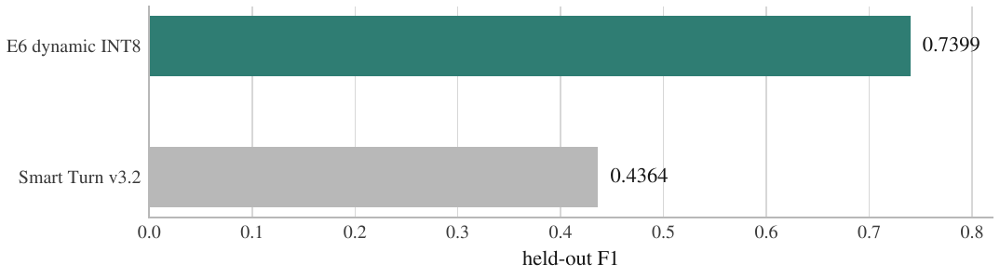
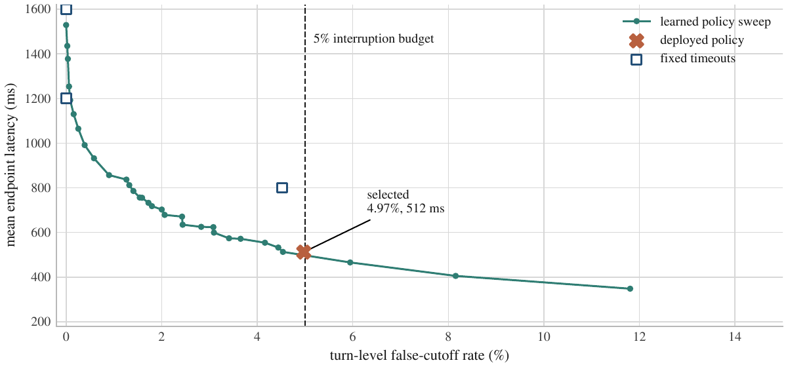
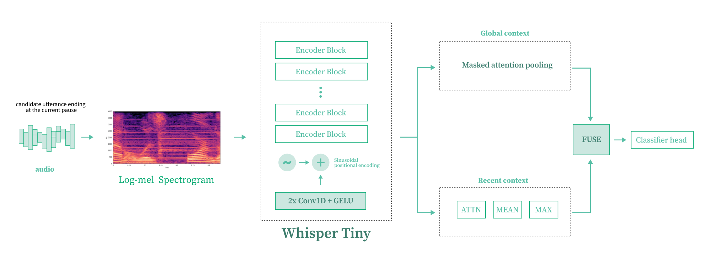
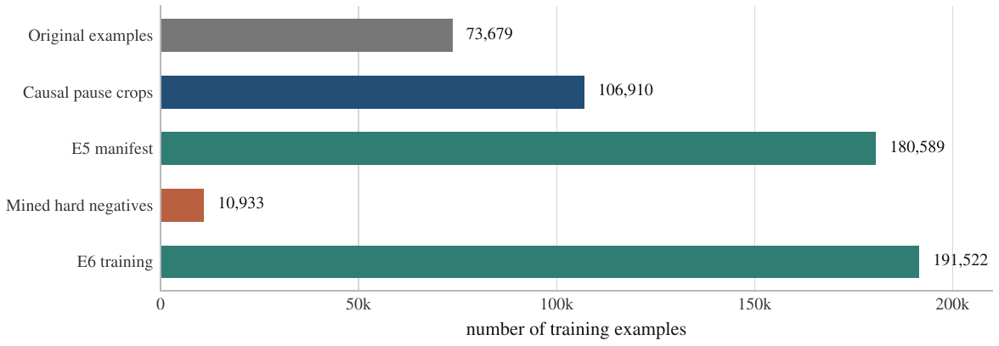
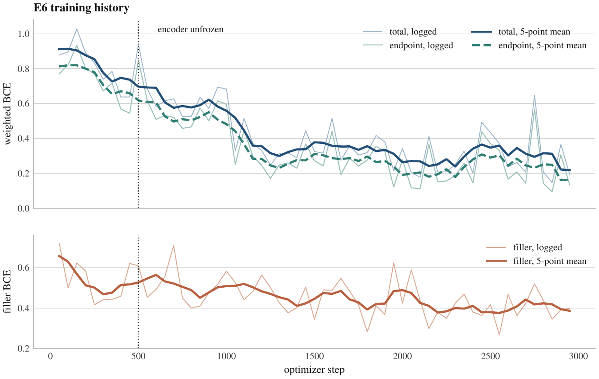
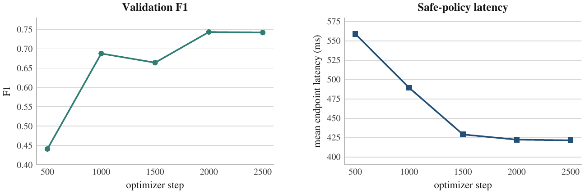
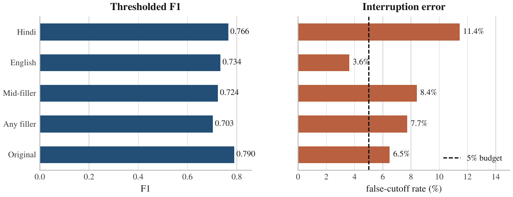
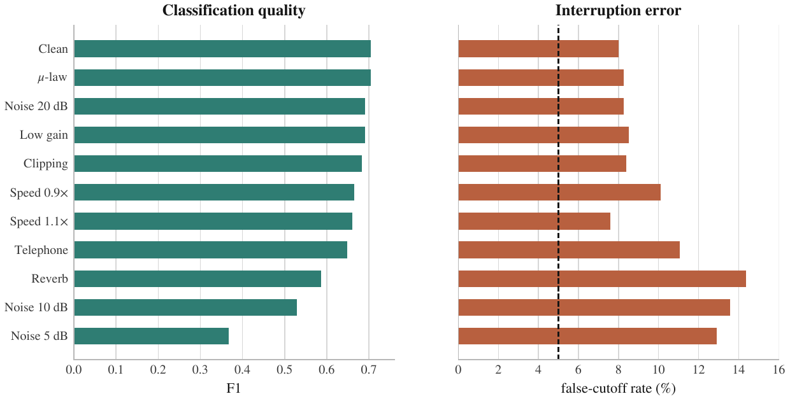
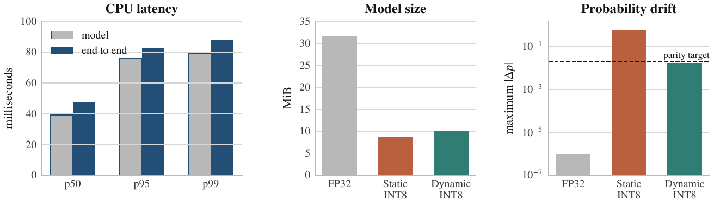

# Turn Detection Model

### Whisper Tiny + dual-scale attention head for low-latency voice AI

An audio-only classifier that decides whether a speaker has finished their turn or is pausing before continuing. The model is built for Hindi and English speech, with explicit training pressure on fillers, internal pauses, and false interruptions. It does not run ASR at inference time.

<p align="center">
  <a href="https://huggingface.co/spaces/Mayank022/hinglish-turn-detector-inference"></a>
  <a href="https://huggingface.co/Mayank022/hinglish-turn-detector-whisper-tiny-dual-scale"></a>
</p>

[Technical report](reports/FINAL_REPORT.md) · [Methodology](reports/METHODOLOGY.md) · [RunPod guide](docs/RUNPOD.md) · [Hugging Face Space guide](docs/HUGGINGFACE_SPACE.md)

## Result

The selected E6 model is an 8.30M-parameter network built from the Whisper Tiny audio encoder, a dual-scale classification head, and one round of hard-negative mining. The deployed artifact is a 10.16 MiB dynamic INT8 ONNX model.

Results below are from 21,995 held-out examples. Temperature, probability threshold, silence delay, and fallback timeout were selected on validation and frozen before test evaluation.

| Metric | E6 dynamic INT8 |
|---|---:|
| F1 | **0.7399** |
| Balanced accuracy | **0.8248** |
| AUROC | **0.9361** |
| Average precision | **0.7983** |
| False-cutoff rate | **4.72%** |
| False-hold rate | 30.33% |
| Expected calibration error | 0.1043 |
| Mean causal endpoint latency | 512.3 ms |
| End-to-end CPU latency, p50 / p95 / p99 | 47.36 / 82.36 / 87.90 ms |
| Dynamic INT8 size | 10.16 MiB |

On the same test rows and under the same validation-selected 5% false-cutoff budget, Smart Turn v3.2 scored 0.4364 F1. This model scored 0.7399, a paired improvement of +0.3035 F1. The 95% parent-turn bootstrap interval was [+0.2884, +0.3182].

<p align="center">
  
</p>

The baseline comparison uses the same held-out rows and a policy selected under the same validation interruption budget. It is not a comparison of independently tuned test-set thresholds.

This is a good result, but it is not the whole story. The Hindi false-cutoff rate is 11.44%, compared with 3.62% for English. Filler-heavy and noisy speech are also harder. Those errors are reported below rather than hidden behind the aggregate score.

## What the model decides

A voice activity detector can find silence. It cannot tell the difference between a finished request and a thinking pause:

```text
"mujhe ek cab book karni hai"          likely COMPLETE
"mujhe ek cab book karni hai, umm..."  likely HOLD
"number is nine eight seven..."        likely HOLD
```

This model is called after a lightweight VAD observes a candidate pause. It scores the last eight seconds of audio and returns a calibrated probability of `COMPLETE`. If the score is below the threshold, the application keeps listening until speech resumes or the fallback timeout is reached.

The deployed policy is:

| Setting | Value |
|---|---:|
| Calibrated threshold | 0.38 |
| Temperature | 2.5522 |
| Minimum candidate silence | 300 ms |
| Fallback timeout | 1,000 ms |
| Test turn-level false-cutoff rate | 4.97% |
| Mean / p95 endpoint latency | 512.3 / 1,000 ms |

<p align="center">
  
</p>

The selected operating point sits just inside the 5% turn-level false-cutoff budget. Moving farther right reduces latency, but causes more interruptions.

The timeout is part of the contract. A low false-cutoff rate is not useful if the system achieves it by waiting several seconds on every turn.

## Architecture

<p align="center">
  
</p>

The global branch carries context from the full turn. The tail branch concentrates on recent cadence, hesitation, and fillers. A separate two-output filler head predicts mid-turn and end-turn fillers during training; it is omitted from the exported inference graph.

| Component | Detail |
|---|---|
| Backbone | `openai/whisper-tiny` encoder |
| Total parameters | 8,299,397 |
| Parameters outside the encoder | 513,413 |
| Input | 16 kHz mono, last 8 s |
| Features | 80 Mel bins, 800 frames |
| Recent window | final 1.5 s |
| Runtime output | calibrated probability and `COMPLETE` / `HOLD` decision |

## Data preparation and training

The standard pipeline accepts only rows marked `hin` or `eng`. It does not admit audio from the other language groups in the source collection. The main label is `endpoint_bool`; `midfiller` and `endfiller` supervise the auxiliary head.

The source metadata does not contain a human-verified Hinglish or code-switch label. Hindi and filler slices are useful for the intended use case, but they are not a Hinglish benchmark. The project does not claim otherwise.

Preparation performs the following operations:

1. Decode, resample, and normalize to mono 16 kHz.
2. Reject empty, non-finite, clipped, or invalid-duration audio.
3. Remove arbitrary terminal silence and add a fixed candidate pause.
4. Keep the most recent eight seconds and left-pad shorter clips.
5. Group exact and near duplicates before splitting.
6. Create causal `HOLD` crops only when later speech proves that the speaker continued.
7. Store prepared audio as FLAC with versioned JSONL manifests.

The E5 manifest contained 180,589 training examples from 73,679 parent utterances: 73,679 original endpoints and 106,910 causal internal-pause crops. Hard-negative mining added 10,933 difficult `HOLD` examples for E6, producing 191,522 training examples. Validation contained 9,493 examples.

<p align="center">
  
</p>

E6 sampling used replacement to create the training mix from the actual manifest:

| Sampling mass | Value |
|---|---:|
| Hindi / English | 50% / 50% |
| COMPLETE / HOLD | 35% / 65% |
| Filler-bearing examples | 53.4% |
| Causal-pause examples | 44.9% |
| Mined hard negatives | 30% |

Training used weighted binary cross entropy for the turn label, with `HOLD` errors weighted 2x, plus a 0.15-weight auxiliary filler loss. The encoder was frozen for the first 500 optimizer steps and then fine-tuned at a lower learning rate than the head.

| Training setting | Value |
|---|---:|
| Physical / effective batch | 32 / 256 |
| Maximum epochs | 4 |
| Encoder / head learning rate | 1e-5 / 1e-4 |
| Warmup | 5% |
| Precision | BF16 |
| Checkpoint selection | validation endpoint delay subject to ≤5% false cutoffs |
| Tracking | Weights & Biases |

On the corrected CUDA 12.4 environment, E6 completed in 1,048 seconds on one NVIDIA L40S. Hard-negative mining took 1,198 seconds. See the [technical report](reports/FINAL_REPORT.md) for the run chronology and the CPU-fallback lesson that led to the bootstrap CUDA check.

### Training dynamics

<p align="center">
  
</p>

The dotted line marks the encoder unfreeze at optimizer step 500. Endpoint loss continues to fall after unfreezing, while the noisier auxiliary filler objective remains bounded.

<p align="center">
  
</p>

Validation F1 rises while the safe-policy endpoint delay falls. Checkpoint selection uses the validation interruption constraint rather than training loss alone.

## Evaluation

### Main slices

<p align="center">
  
</p>

| Slice | Count | F1 | False-cutoff rate |
|---|---:|---:|---:|
| Hindi | 3,124 | 0.7656 | 11.44% |
| English | 18,871 | 0.7340 | 3.62% |
| Mid-filler | 5,099 | 0.7239 | 8.40% |
| Any filler | 6,235 | 0.7034 | 7.73% |
| Original endpoint examples | 8,955 | 0.7905 | 6.48% |

The Hindi F1 is higher than the English F1, but Hindi false cutoffs are much worse. For a turn detector, that distinction matters more than the headline F1.

Some important slices contain only one class. F1 is undefined for those slices, so the generated report prints `Not available` instead of inventing a value. The full machine-readable report retains the underlying predictions for deeper error analysis.

### Robustness

The robustness subset was deterministically stratified across language, label, original/causal examples, filler type, and synthetic status. Every corruption used the same selected records.

<p align="center">
  
</p>

| Condition | F1 | False-cutoff rate |
|---|---:|---:|
| Clean subset | 0.7044 | 7.99% |
| Clipping | 0.6835 | 8.39% |
| Low gain | 0.6904 | 8.52% |
| μ-law | 0.7042 | 8.26% |
| Noise, 20 dB | 0.6905 | 8.26% |
| Noise, 10 dB | 0.5283 | 13.58% |
| Noise, 5 dB | 0.3679 | 12.92% |
| Reverb | 0.5861 | 14.38% |
| Speed 0.9x | 0.6653 | 10.12% |
| Speed 1.1x | 0.6608 | 7.59% |
| Telephone | 0.6477 | 11.05% |

Moderate noise, clipping, gain changes, and μ-law remain usable. Heavy noise and reverb are clear failure modes and should be addressed with targeted augmentation before treating this as a production endpointing policy.

### Quantization

Static activation quantization made the model smaller but changed its probabilities too much. It was rejected. Dynamic weight-only quantization is slightly larger and preserves the FP32 scores closely enough for deployment.

<p align="center">
  
</p>

| Export | Size | Max probability delta | Mean delta | Decision |
|---|---:|---:|---:|---|
| FP32 ONNX | 31.73 MiB | 0.000001 vs PyTorch | — | Reference |
| Static INT8 QDQ | 8.68 MiB | 0.574263 | — | Rejected |
| Dynamic INT8 weight-only | 10.16 MiB | 0.017759 | 0.009105 | Selected |

### CPU latency

Latency was measured with ONNX Runtime using one intra-op thread on the RunPod x86 host. Model-only timing excludes feature extraction. End-to-end timing includes waveform standardization, Whisper log-Mel extraction, calibration, and ONNX inference; it excludes audio decoding and policy silence waiting.

| Path | p50 | p95 | p99 |
|---|---:|---:|---:|
| Model only | 39.15 ms | 75.89 ms | 79.14 ms |
| End to end | 47.36 ms | 82.36 ms | 87.90 ms |

## Use the model

The published [Hugging Face model repository](https://huggingface.co/Mayank022/hinglish-turn-detector-whisper-tiny-dual-scale) contains the dynamic INT8 and FP32 ONNX exports, PyTorch weights, the calibrated policy, configuration, and machine-readable evaluation reports.

```bash
uv sync --extra runtime
```

```python
from turn_detector.audio import load_audio
from turn_detector.inference import TurnDetector

detector = TurnDetector.from_pretrained("Mayank022/hinglish-turn-detector-whisper-tiny-dual-scale")
audio, sample_rate = load_audio("candidate_pause.wav")
prediction = detector.score(audio, sample_rate)

print(prediction.probability)
print(prediction.decision)
print(prediction.recommended_wait_ms)
```

To score a local release:

```bash
uv run turn-detector predict \
  --model-path artifacts/release/e6_dynamic/hinglish-turn.int8.onnx \
  candidate_pause.wav
```

The exported ONNX contract is:

| Tensor | Type and shape |
|---|---|
| `input_features` | float32 `[batch, 80, 800]` |
| `frame_mask` | int64 `[batch, 800]` |
| `p_complete` | float32 `[batch, 1]` |

## Gradio and Hugging Face Spaces

Try the public [Gradio inference demo](https://huggingface.co/spaces/Mayank022/hinglish-turn-detector-inference) before running it locally. It supports preset examples, file upload, and microphone recording.

Launch the polished microphone/upload demo locally:

```bash
uv sync --extra runtime --extra demo
HINGLISH_TURN_MODEL=Mayank022/hinglish-turn-detector-whisper-tiny-dual-scale \
uv run python app.py
```

The interface shows the calibrated probability, `COMPLETE` / `HOLD` policy decision, model
latency, recommended wait, and an annotated waveform. It also includes the measured E6 results,
architecture, and limitations. The `/predict` Gradio endpoint remains available for programmatic
clients.

For deployment, use [`SPACE_README.md`](SPACE_README.md) as the Space repository README and follow
[`docs/HUGGINGFACE_SPACE.md`](docs/HUGGINGFACE_SPACE.md). A private model requires an `HF_TOKEN`
Space secret with read access. No token is stored in this repository.

## Train and reproduce

Python 3.11 or 3.12 is supported. The reproducible RunPod path uses `uv`, pinned source and base-model revisions, a persistent `/workspace` volume, tmux, W&B, and explicit Hugging Face publishing.

```bash
bash scripts/runpod_bootstrap.sh
bash scripts/runpod_pipeline.sh
```

The pipeline runs:

```text
cache → prepare → E5 → hard-negative mining → E6 → dynamic INT8 export
      → calibration → evaluation → baseline comparison → package
```

It never uploads a model automatically. Restart from a completed stage when necessary:

```bash
PIPELINE_START_AT=mine \
bash scripts/runpod_pipeline.sh
```

For an existing verified dynamic export, finalize all downstream evidence with:

```bash
bash scripts/runpod_dynamic_finalize.sh
```

Long stages emit timestamped progress, ETA, checkpoint, validation, and completion events. Full RunPod setup, monitoring, recovery, and upload commands are in [docs/RUNPOD.md](docs/RUNPOD.md).

Run local checks with:

```bash
uv sync --extra dev
uv run ruff check .
uv run mypy src
uv run pytest
```

## Repository map

```text
configs/                 data, model, training, policy, and experiment configs
scripts/                 RunPod bootstrap and end-to-end pipelines
src/turn_detector/       preparation, model, trainer, inference, export, evaluation
tests/                   data, sampling, model, calibration, and evaluation tests
reports/FINAL_REPORT.md  measured E6 report and failure analysis
reports/METHODOLOGY.md   experiment and evaluation contract
docs/RUNPOD.md           cloud setup and operational commands
app.py                   Gradio entry point
```

## Limits

- There is no human-verified Hinglish/code-switch label in the source metadata, so this release has no measured Hinglish-specific score.
- Hindi false cutoffs (11.44%) and filler false cutoffs (7.73%) exceed the overall target.
- Heavy noise and reverb cause large regressions.
- English rows are not guaranteed to be exclusively Indian English.
- Speaker identities are unavailable; split protection uses parent utterances, hashes, acoustic fingerprints, and source strata.
- Some Hindi audio is synthetic.
- The model uses audio only. It does not see transcript semantics, conversation history, dialog state, or speaker identity.
- This is endpoint detection, not VAD, diarization, backchannel classification, or barge-in policy.

The source collection does not currently state one explicit license for the complete dataset. The model repository therefore remains private with `license: other` until derived-weight distribution terms are reviewed. Source audio, API keys, and optimizer state are excluded from the packaged release.
